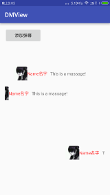

# 当前库由于问题诸多已弃用，新DMView2地址：
https://github.com/xujiaji/DMView2


# DMView [中文介绍](http://www.jianshu.com/p/6649f5239aef)
Library for display Bullet screen.You only need to add a few base info.
# Now Version
2.0.0
# Screen


#Installation
To use this library in your android project, just simply add the following dependency into your build.gradle
```
dependencies {
    compile 'com.github.xujiaji:dmlib:2.0.0'
}
```
#Usage
### 1.You need to have a RecyclerView(This is in the sample project's activity_main.xml)
``` xml
    <android.support.v7.widget.RecyclerView
        android:id="@+id/rvBarrage"
        android:layout_width="match_parent"
        android:layout_height="match_parent"
        android:layout_marginTop="90dp"
        android:layout_marginBottom="90dp"
        android:overScrollMode="never" />
```

### 2.Initialize "DanMu" in find RecyclerView
##### ①Init-1 : Use "dmlib" default layout and rows
``` java
rvBarrage = (RecyclerView) findViewById(R.id.rvBarrage);
DanMu.init(rvBarrage);
```

##### ②Init-2: Config yourself layout
``` java
        Config config = new Config(
        R.layout.item,
        R.id.tvName,
        R.id.tvMsg,
        R.id.imgHead);
        config.setRowNum(5);//setting bullet screen's rows
        DanMu.init(rvBarrage, config);
```

- Display Run Results



- Note: If you do not name can refer to the following.
``` java
        Config config = new Config(
        R.layout.item,
        0,
        R.id.tvMsg,
        R.id.imgHead);
```

##### ③Init-3:Setting bullet screen's rows
```
        Config config = new Config();
        config.setRowNum(3);
        DanMu.init(rvBarrage, config);
```

##### ④Init-4:Setting bullet screen's animator duration
```
        Config config = new Config();
        config.setDuration(10000);
        DanMu.init(rvBarrage, config);
```

### 3.Add a Bullet screen
``` java
DanMu.call()
        .picUrl("https://ss0.bdstatic.com/70cFvHSh_Q1YnxGkpoWK1HF6hhy/it/u=150237755,4294706681&fm=116&gp=0.jpg")
        .name("xujiaji")
        .msg("Bullet screen massage show ...")
        .show();
```
- Note: If the default layout, you will have to remove a part of a different layout

>No.1

``` java
DanMu.call()
        .picUrl("https://ss0.bdstatic.com/70cFvHSh_Q1YnxGkpoWK1HF6hhy/it/u=150237755,4294706681&fm=116&gp=0.jpg")
        .msg("Bullet screen massage show ...")
        .show();
```
>No.2

``` java
DanMu.call()
        .msg("Bullet screen massage show ...")
        .show();
```
>No.3

``` java
DanMu.call()
        .name("xujiaji")
        .msg("Bullet screen massage show ...")
        .show();
```
>No.4

``` java
DanMu.call()
        .picUrl("https://ss0.bdstatic.com/70cFvHSh_Q1YnxGkpoWK1HF6hhy/it/u=150237755,4294706681&fm=116&gp=0.jpg")
        .show();
```
|No.1|No.2|No.3|No.4|
|:-:|:-:|:-:|:-:|
|||||

### 3. Destroy bullet screen 
```java
    @Override
    protected void onDestroy() {
        DanMu.destroy();
        super.onDestroy();
    }
```

### Activity all codes
``` java
public class MainActivity extends AppCompatActivity {
    private RecyclerView rvBarrage;

    @Override
    protected void onCreate(Bundle savedInstanceState) {
        super.onCreate(savedInstanceState);
        setContentView(R.layout.activity_main);
        rvBarrage = (RecyclerView) findViewById(R.id.rvBarrage);
        //sample.1: default init
        DanMu.init(rvBarrage);

        //sample.2: config yourself layout
//        Config config = new Config(
//                R.layout.item,
//                R.id.tvName,
//                R.id.tvMsg,
//                R.id.imgHead);
//        config.setRowNum(5);  // setting bullet screen's rows
//        DanMu.init(rvBarrage, config);

        //sample.3: setting bullet screen's rows
//        Config config = new Config();
//        config.setRowNum(3);
//        DanMu.init(rvBarrage, config);

        //sample.4 setting bullet screen's animator duration
//        Config config = new Config();
//        config.setDuration(10000);
//        DanMu.init(rvBarrage, config);
    }

    public void onAddClick(View view) {
        DanMu.call()
                .picUrl("https://ss0.bdstatic.com/70cFvHSh_Q1YnxGkpoWK1HF6hhy/it/u=150237755,4294706681&fm=116&gp=0.jpg")
                .name("xujiaji")
                .msg("Bullet screen massage show ...")
                .show();
    }

    @Override
    protected void onDestroy() {
        DanMu.destroy();
        super.onDestroy();
    }
}
```
#Change Logs
###v2.0.0
Change library animator, it was originally RecyclerView Animation Library on github. Now animation is realized by modifying DefaultItemAnimator.<br />
Added set animate duration.<br />
You can destroy 'DanMu' by ‘DanMu.destroy()’.

###v1.1.1
This is a large of modification. <br />
Modify add Bullet screen mode and can Adding custom layout. <br />
You can set RecyclerView rows.
###v1.0.0
Initial version,Only realized the Bullet screen function

#License

    Copyright 2016 xujiaji

    Licensed under the Apache License, Version 2.0 (the "License");
    you may not use this file except in compliance with the License.
    You may obtain a copy of the License at

       http://www.apache.org/licenses/LICENSE-2.0

    Unless required by applicable law or agreed to in writing, software
    distributed under the License is distributed on an "AS IS" BASIS,
    WITHOUT WARRANTIES OR CONDITIONS OF ANY KIND, either express or implied.
    See the License for the specific language governing permissions and
    limitations under the License.
