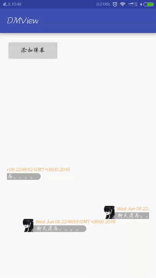
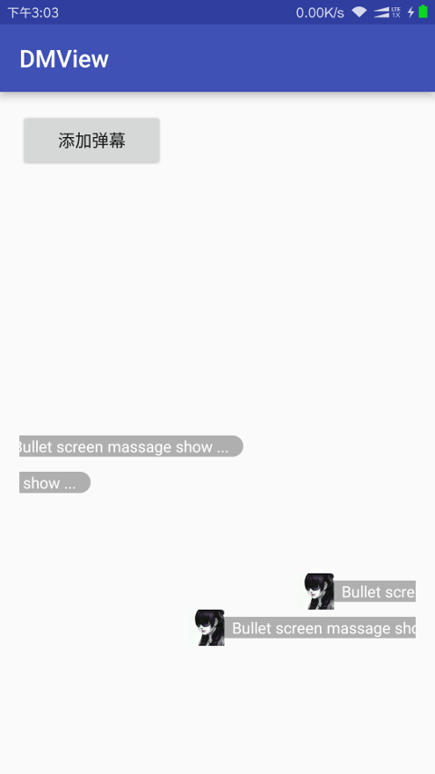
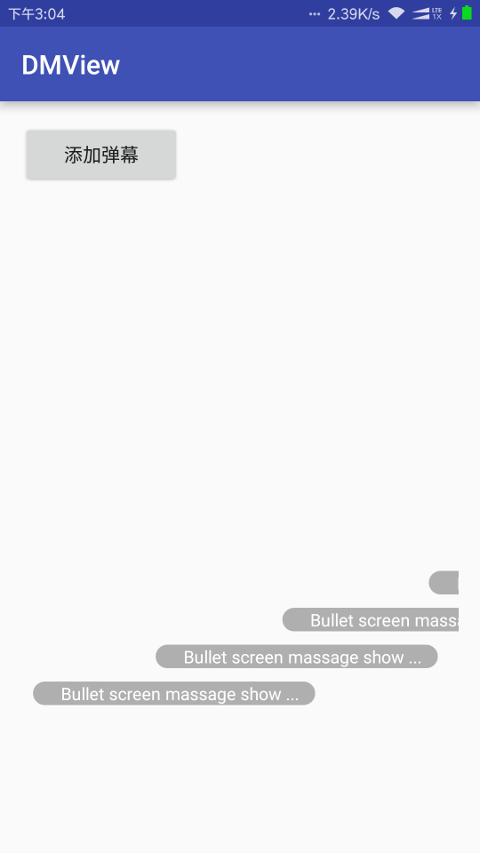
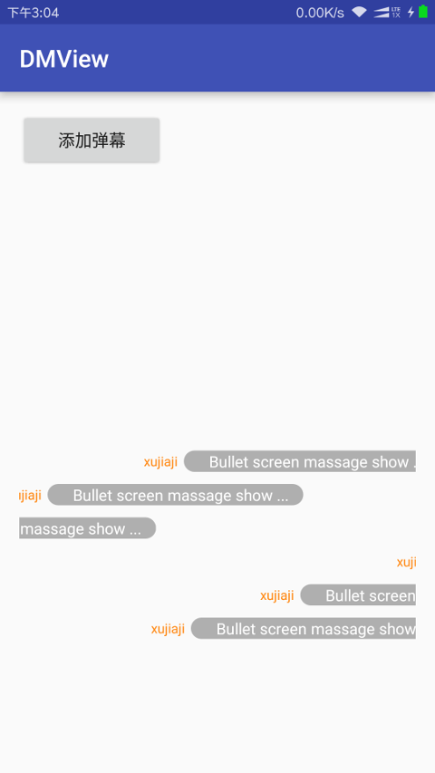

# DMView [中文介绍](http://www.jianshu.com/p/2232a63442d6)
Library for display Bullet screen.You only need to add a few base info.
# Version
1.0.0
# Screen


#Installation
To use this library in your android project, just simply add the following dependency into your build.gradle
```
dependencies {
    compile 'com.github.xujiaji:dmlib:1.0.0'
}
```
#Usage
### 1.You need to have a RecyclerView(This is in the activity_main.xml)
``` xml
    <android.support.v7.widget.RecyclerView
        android:id="@+id/rvBarrage"
        android:layout_width="match_parent"
        android:layout_height="match_parent"
        android:layout_marginTop="90dp"
        android:layout_marginBottom="90dp"
        android:overScrollMode="never" />
```

### 2.Initialize "DanMu" in find RecyclerView
##### ①Init-1 : Use "dmlib" default layout and rows
``` java
rvBarrage = (RecyclerView) findViewById(R.id.rvBarrage);
DanMu.init(rvBarrage);
```

##### ②Init-2: Use your custom layout or rows.Default 6 rows.
``` java
        Config config = new Config(
        R.layout.item,
        R.id.tvName,
        R.id.tvMsg,
        R.id.imgHead);
        config.setRowNum(5);//set rows
        DanMu.init(rvBarrage, config);
```
- Note: If you do not name can refer to the following.
```
        Config config = new Config(
        R.layout.item,
        0,
        R.id.tvMsg,
        R.id.imgHead);
```
### 3.Add a Bullet screen
``` java
DanMu.call()
        .picUrl("https://ss0.bdstatic.com/70cFvHSh_Q1YnxGkpoWK1HF6hhy/it/u=150237755,4294706681&fm=116&gp=0.jpg")
        .name("xujiaji")
        .msg("Bullet screen massage show ...")
        .show();
```
- Note: If the default layout, you will have to remove a part of a different layout

|`picUrl msg|||
|:-:|:-:|:-:|:-:|
|||||

### Activity all codes
``` java
public class MainActivity extends AppCompatActivity {
    private RecyclerView rvBarrage;

    @Override
    protected void onCreate(Bundle savedInstanceState) {
        super.onCreate(savedInstanceState);
        setContentView(R.layout.activity_main);
        rvBarrage = (RecyclerView) findViewById(R.id.rvBarrage);
        DanMu.init(rvBarrage);
//        Config config = new Config(
//                R.layout.item,
//                R.id.tvName,
//                R.id.tvMsg,
//                R.id.imgHead);
//        config.setRowNum(5);
//        DanMu.init(rvBarrage, config);
    }

    public void onAddClick(View view) {
        DanMu.call()
                .picUrl("https://ss0.bdstatic.com/70cFvHSh_Q1YnxGkpoWK1HF6hhy/it/u=150237755,4294706681&fm=116&gp=0.jpg")
                .name("xujiaji")
                .msg("Bullet screen massage show ...")
                .show();
    }
}
```
#Change Logs
###v1.0.0
Initial version,Only realized the Bullet screen function
###v1.1.1
This is a large of modification. 

Modify add Bullet screen mode and can Adding custom layout. 

You can set RecyclerView rows.
#License

    Copyright 2016 xujiaji

    Licensed under the Apache License, Version 2.0 (the "License");
    you may not use this file except in compliance with the License.
    You may obtain a copy of the License at

       http://www.apache.org/licenses/LICENSE-2.0

    Unless required by applicable law or agreed to in writing, software
    distributed under the License is distributed on an "AS IS" BASIS,
    WITHOUT WARRANTIES OR CONDITIONS OF ANY KIND, either express or implied.
    See the License for the specific language governing permissions and
    limitations under the License.
